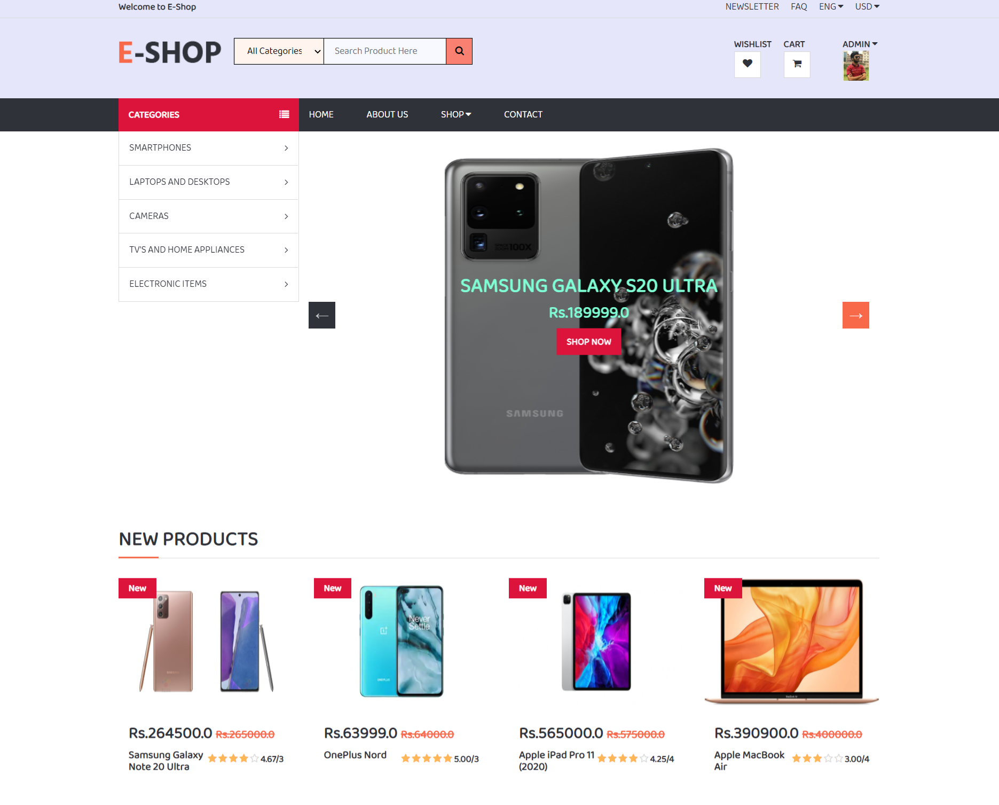

# **Django E-commerce**
### *Hello guys! welcome to my django e-commerce project...*

## What makes this project stand out?
* Customized interactive admin panel using **bootstrap-admin**... Say bye bye to the default django Admin dashboard
* Categories and Sub-categories managed using&nbsp; **Django-MPTT** ... wanna know more about it! Click&nbsp; **[here](https://django-mptt.readthedocs.io/en/latest/overview.html)** 
* Integrated a text-editor package called&nbsp;**Django CKEditor** in Admin Panel which provides a rich text editing field with image uploading capability and many more other features
* Created **Auto-complete Search** &nbsp;functionality (like as in amazon,flipkart) using&nbsp; **jQuery AJAX Autocomplete Widget**... sounds cool right!
* **Multiple image gallery** &nbsp;for a single product(like as in amazon,flipkart) inside product details section 
* Users/Customers can&nbsp; **rate a product** and&nbsp; **write a review** on that product... Average rating&nbsp; is displayed out of total ratings count..
* **Detailed Specifications** of every products listed out..
* User can update their **profile/account information** any time they wish..
* Do you often forget passwords ? If yes, i got u...it supports the functionality to **reset passwords** using email.. Also u can **change your old passwords** anytime..
* Nevertheless&nbsp; **Checkout process** is also working perfect (in case you wonder ; it's just a fake checkout that let's user to enter credit card credentials and displays as payment done!.. Integrating payment gateway api for localhost projects is a tedious job)

*** 

## **Before running this project you need to install these apps and packages:**

#### First of all you need to have python **3.6** or **above** installed in your system.
#### Get it from here:&nbsp; **[Python](https://www.python.org/downloads/ "Python")**
#### Then install pip as: &nbsp; `python get-pip.py`

#### Now install following packages one by one:

`pip install django`

`pip install bootstrap-admin`

`pip install django-ckeditor`

`pip install django-mptt`

`pip install pillow`
<br>

### **If you wanna avoid this hassle.. there is an alternative ... U can install required packages for the project as..**

```
pip install -r requirements.txt
```
### Finally after every requirements is satisfied run the project as:

```
python manage.py runserver
```
<br>

> Note: &nbsp; If you are still getting errors then either you did something wrong or one/more of the project requirements are still missing...Try to follow all above steps and it should work fine..

<br>

> If u wanna access admin section both Username and Passwords are:&nbsp; **admin**

---

## **Some Snapshots:** 
<br>

<p align="center">
 



</p>

---

## **How to contribute to this project:**
#### 1. Run this project in your pc and if you encounter any errors or bugs feel free to report it 
#### 2. You can also fork this repo and create a pull request
#### 3. Email me at:&ensp;*risingstar3993@gmail.com*  for any issues.. your feedback is most welcomed!

<br>

> Even after working for days and nights still there are many things left to be implemented in this project ... E-commerce is itself a huge project to complete single-handedly... Nevertheless if u 👍 this project plz give it a ⭐️ ... Motivates me to work further hard!..

> Stay happy😃&nbsp; Stay Calm..&nbsp; Keep Coding!  


 